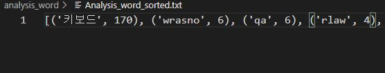
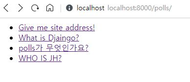
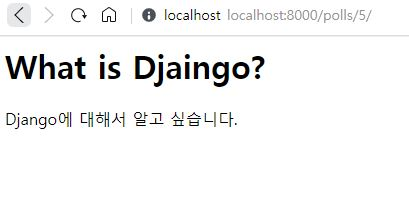
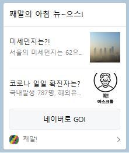
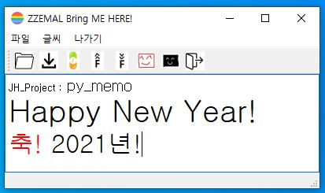
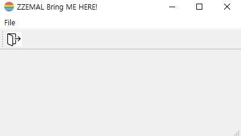
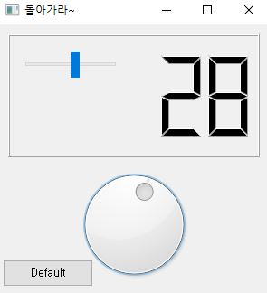

# JH_project
김재현의 프로젝트들을 모아둔 Git 저장소이다.😂

</img><br/>


## analysis_word
`시작동기` : 좋은 아이디어라 생각하여 회사에서 ppt발표를 해버렷고, 구체화를 하기 시작했다.

### 기능
1. 단어를 분류한다.
2. 단어의 중복 숫자에 따른 정렬(sort)를 한다.
3. 단어의 중복 횟수에 따른 action이 생긴다.
4. 일정 기간을 주기로 mail을 보낸다. - gmail 사용

### 저장 파일
 - Analysis_word : 딕셔너리 형태로 저장 , json으로 load해서 다시 딕셔너리로 사용하기 위해 저장하였다.
```py
    analysis_dict = json.loads(replace_data)
```
- Analysis_word_sorted : 단어의 중복횟수가 높은 순서대로 정렬된 파일. 보기 편하기 위해 따로 저장하였다.
### 결과
</img>  
요런식으로 { '키워드 ' : 저장 횟수} 형태로 저장 된다.

## django
`시작동기` : 웹 페이지를 예전부터 만들어 보고 싶었는데, **파이썬**으로 만들수 있는 **웹 프레임워크**가 있다는걸 확인하고 한번 시작하게 되었다.  
`사이트` : [점프 투 장고](https://wikidocs.net/78004)

### 기본 환경 세팅
1. 파이썬 설치 & 가상환경 설치 : virtualenv 설치 ( 설정 안꼬이려고 가상환경 쓴다.)
2. 가상환경실행 :  virtualenv --system-site-packages -p python3 FirstDjango
3. 가상환경 실행파일 (*.cmd)파일 생성
> Window OS 에서 어떤 경로에서도 실행파일(cmd)을 바로 실행할 수 있게 하려면 `환경 변수>PATH >새로 만들기` 를 하면 된다.
4. 장고 설치 : pip install django==3.1.3
5. 장고 프로젝트 설치 : $ django-admin startproject config(이름바꿔도됨) .
6. 개발 서버 구동 : python manage.py runserver

### 새 프로젝트 만들기
```
django-admin startapp polls
```
1. urls.py 만들기
2. views.py 만들고 index 함수 만들기  

### 데이터관리  
원래 DB 관리할라면 <u>쿼리(query)문</u>을 알아야된다. BUT, 필요없다.  
Django가 알아서 **ORM(object relational mapping)** 을 통해서 연결해주기 때문이다.  
데이터는 **db.sqlite3** 에 저장이 된다. -> SQL 설치 후 확인 가능 
```cmd
python manage.py migrat #이주한다..? 환경을 옮겨온다 생각하면 될듯

python manage.py makemigrations #모델 만든거 새로 적용
python manage.py migrate # 실제 적용
```
### 데이터 모델 이용해보기
```cmd 
python manage.py shell

from polls.models import Question, Answer
from django.utils import timezone

[Question]
q = Question(subject='polls가 무엇인가요?', content='polls에 대해서 알고 싶습니다.', create_date=timezone.now())
q.save()
Question.objects.all(), Question.objects.filter(id=1) # 확인 방법

[Answer]
a = Answer(question=q, content='네 자동으로 생성됩니다.', create_date=timezone.now())
a.save()
a.question
q.answer_set.all() # 확인 방법
```
### 데이터 모델을 이용한 질문 목록 만들기
- root 폴더 밑에 template 생성  
데이터 저장 경로로 설정 : ~/config/setting.py
```py
    'DIRS': [BASE_DIR / 'templates'],
```
- url에 path 추가
```py
path('<int:question_id>/', views.detail),
```
- views.py 에 질문 관련 함수 생성
```py
def index(request):
    question_list = Question.objects.order_by('-create_date') #역순 정렬
    context = {'question_list': question_list}
    return render(request, 'polls/question_list.html', context)
```
> polls/question_list.html 생성 후 내용 채우기
```py
def detail(request, question_id):
    question = get_object_or_404(Question, pk=question_id)
    context = {'question': question}
    return render(request, 'polls/question_show.html', context)
```
> polls/question_show.html 생성 후 내용 채우기
- 네임스페이스 지정 및 URL 별칭 부여
```py
app_name = 'polls' #namespace
path('<int:question_id>/', views.detail, name='detail'), #별칭 = name = detail
```
> polls/question_list.html 내용 네임스페이스에 맞추어 수정
#### 결과 
</img>  
</img>
___

## kakao_msg
나에게 카카오 메시지를 보내는 프로젝트이다.  
카카오 메세지 API를 이용했다.
**webcrawling**을 이용해서 그날의 **미세먼지**,**코로나 확진자수**를 찾아 `리스트` 형태에 담아 메시지를 보냈다.
### 방법
* 카카오메시지 Rest API url을 통해 response를 받는다.
* webcrawling으로 naver검색 엔진에서 미세먼지 및 확진자 정보를 가져온다.
* 헤더, 설명, 버튼, 이미지, 링크등 채워넣는다.  
### 결과 
</img>
___

## py_memo
`시작동기` : 여자친구가 가볍게 웃으면서 쓰는 일기장을 하나 만들어 보고 싶었다.
### 시나리오
1. exe파일을 실행하면 메모장이 뜬다.
2. 오늘의 하루 일기를 간단히 쓴다.
3. 마지막에 오늘의 색을 정하는 버튼이 있다.
4. 색에 따라 메시지 창이 다르게 반응!
5. 저장은 특정 경로에 저장 되게 한다.
저장 이름은 카운트에 따라 다르게 되게끔 한다.
(날짜를 받아와서 날짜로 저장되게 하자)
6. 룰렛 기능이나 랜덤을 통해 특정 주제(웃긴거 or 흥미유발)을 정하고 webcrawling을 통해 사진을 가져와서 띄운다.

### 시나리오 구현
1번 시나리오 : **pyqt5** 와 **pyinstaller** 를 이용하였다.  
>참고: pyinstaller 는 cross-compile이 안되기에, window에서 컴파일하면 window에서만 실행이가능하다.  

2번 시나리오 : pyqt5의 **QTextEdit** 기능을 이용하였다.  
5번 시나리오 : datetime 모듈을 통해 실시간 시간 정보를 가져오고, 이를 문자로 저장하였다.
이를 이용하여 저장 파일의 이름을 결정하였다.  

```py
import datetime
        dt = datetime.datetime.today()
        today = str(dt)
        today1 = today.replace('-','')
        today2 = today1.replace(':','-')
        ...
        f = open("UZ in {}.txt".format(today2[:17]),'w')
```
### 동작 기능
파일 열기, 다른이름으로 저장, 시간이름으로 저장, 폰트 사이즈 업&다운, 글씨색 변화, 앱 종료
21.01.10 : 메모장 내에 단어들을 분석하는 기능을 추가했다. ( 단어별로 분류하고, 갯수를 파악하는 기능)
### 결과 
Version1.0 : 시나리오의 1,2,5번 구현 완료. 색에 관한 이벤트를 추가해야된다.  
</img>  *version1.0 결과 사진*

#### 아쉬웠던점
>21.01.01 기록 : version 1.0
 - pyinstaller가 cross-compile이 되지 않는점.
 - 코드 반복이 많았던 점
 - 다른 이름 저장을 할때 직접 .txt를 작성해줘야된다.
 - 이모티콘 작성이 불가능한 점

___

## pyqt5
qt란 C++ 코드를 GUI로 구현하는 프로그램이다.
pyqt로 확장되어 python을 GUI로 구현할 수 있게 되었다.

기본적인 **widget** 생성하여 **menu,button**등을 구성해보았고,**mouse** 및 **keyboard** 이벤트 발생을 이용해보았다.  
마무리로 pyinstaller 을 통해 exe파일로 만드는것 까지 해보았다.
```
pyinstaller -w -F "python파일"
```
### 결과
아이콘 변경, 타이틀 설정, 단축기 설정, 메뉴바 & 창태바 추가, 상태메시지, 중심 위치 설정  
</img>  
슬라이더 및 다이얼 설정, 둘의 연동, lcd에 숫자 표시, 리셋(default) 버튼  
</img>  
___  

## startgit
이 폴더는 제일 처음 깃을 사용했을때 만들었던 폴더이다.  
~~그래서 나도 뭐가 들어있는지 모르겠다 ㅋㅋ~~

## study_c
C언어 공부를 위한 폴더이다. 
.vscode폴더 내에 vscode에서 c언어를 컴파일하고 디버깅하기 위한 세팅이 들어있다.
[dojang(도장)](https://dojang.io)을 보고 공부했다.
|Day|Work|
|:--:|:--|
|20.12.27| unit1 ~ unit4 : Setting IDE & Print|
|20.12.28| unit5 ~ unit6 : variable & Debug|
|20.12.29| unit7 : type of int|
|21.01.10| unit 8 ~13 : types % input & +,-,*,/,%|
## study_py
파이썬 공부를 위한 폴더이다. 파이썬 관련 파일들이 모여있다.

## SWTEST
SW test 기출문제들이다. 
## vscode_cmake
기본적인 cmake형식이다.

## webcrawling
web크롤링 파일이다. 
naver에서 타이틀을 가져오는것을 해보았다.

## webpage
**21.1.19** 본격적인 web 공부 시작!  
`시작동기` : 갑작스러운 진로고민으로 인해 채용 공고를 보는 도중 웹 페이지를 만들어 보고, 웹에 대한 이해는 필요하다 생각해서 시작하였다.😉(그 과정에서 이모지를 알게 되었다는 사실 ..🤦‍♂️)
사실 이전에 이미 한번 웹 페이지를 만들어보고 이미지에 css를 이용해서 스타일까지 입혀줘봤었다.
그래도 이번엔 제대로 개념부터 시작해서 차근차근 해보고 싶어 이렇게 장황하게 글을 써보았다.  
`코딩메이트` : [생활코딩](https://opentutorials.org/course/3084)  
python이나 c는 코딩도장을 이용했는데, 웹은 코딩도장이 없어서 찾아보던 중 알게 되었다. 프로젝트 동기 글을 읽어 보았는데, 참 귀감이 되시는 분인 것 같다. 특히, 딱히 마땅한 포맷이 없는 것 같아 만들기 시작했다는 말이 너무 멋있었다.👍
>이분은 그림체가 너무 이쁘다. 디자이너 출신인가..??🖋
### TIL D+1
- 크롬에서 ctrl + o 해서 html을 열어 볼수 있는줄 몰랐다.
- strong 강조(굵게!) /strong>
- u 언더라인! /u
- 요런거를 **TAG** 라 부른다. (중복 가능)

```
정보기술은 역사가 길지 않습니다.
좋게 말하면 최신이고, 
안 좋게 말하면 근본이 약합니다. 
부족한 근본을 어디서 빌려왔을까요?
많은 것이 일상에 대한 비유와 은유입니다.
그런 점에서 컴퓨터는 하나의 거대한 시입니다.
컴퓨터가 차갑게 느껴질 수 있지만,
컴퓨터 공학은 사실
낭만적인 것으로 가득 차 있습니다.
-생활코딩 글 중 : 🌈WOW✨
```

(21.1.9)
[개념! 자바 vs 자바스크립 의 차이](http://blog.wishket.com/%EC%9E%90%EB%B0%94-vs-%EC%9E%90%EB%B0%94%EC%8A%A4%ED%81%AC%EB%A6%BD%ED%8A%B8-%EC%B0%A8%EC%9D%B4%EC%A0%90-%ED%95%B5%EC%8B%AC%EA%B8%B0%EB%8A%A5/)

### TIL D+2
- 깨알 : 갑자기 마크다운 프리뷰 단축키를 까먹었다 🤦‍♂️🔥
```
ctrl + shift + p (팔레트 단축키) / ctrl + shift + v (마크다운)
```
- 오히려 개념적으로 접근해서 좋다. HTML의 '<h>'로 이루어진 제목과 그냥 size와 시각적 효과로 동일하게 만든 제목의 차이점을 통해 기본의 중요성 및 효율적인 코딩에 대한 고민을 하게 하는 것이 좋은 가르침인 것 같다.✔
- 속성(attribute)의 두두~등장! => 태그만의로 정보가 부족할 때 사용!
- [public domain image website](https://filmora.wondershare.com/video-editing-tips/best-websites-download-free-public-domain-images.html?gclid=CjwKCAiAo5qABhBdEiwAOtGmbrFggwA0J-xk9Rjr71vR77r1jrLEb0cVS8lizUhtiM7eyNB2cyTLmRoCCfQQAvD_BwE)
- `img src='address'` 를 통해 이미지를 웹 페이지에 부를 수 있다.  또한, width ="80%" 처럼 퍼센트으로도 너비, 높이 조절이 가능하다.(픽셀로만 가능한줄 알았따..😶🙄)
- 부모 - 자식 관계의 태그가 존재한다 라..🖋
- 보통은 부모 - 자식 관계가 정해져 있지 않지만, 고정되어 있는 놈들이 있다. 👈요걸 공부해보자
-  ul : 글머리 목록, ol : 순서 목록
>ul은 <u>u</u>nordered <u>l</u>ist의 약자이고, ol은 <u>o</u>rdered <u>l</u>ist의 약자랍니다.
- 지금 이 재밌는 기분..이어서 차근차근 해보자! 화이팅!🐱‍🏍
### TIL D+3
- 웹 페이지의 구조를 정해주는 태그들이 가장 많이 쓰이는 태그들이다!
- title 웹페이지의 제목을 설정 할 수 있다!/title
- title 이던, head 등을 쓰는 이유가 검색 엔진, 즉 컴퓨터가 분석할 수 있도록 해주는 것이다.
> 알고리즘의 선택 같이 검색 엔진의 간택을 받을라면 이런걸 명확하게 잘 맞추어 작성해야 된다.
- 또잉, utf-8 인코딩 설정을 알려주는게 닫힌 태그가 없는 meta charset = "utf-8" 이였다..요런 디테일도 존재하다니😀
- 정말.. 설명이 기똥차다.. 본문을 설명하는 부분을 head에 본문을 body로 구분을 했을 뿐이다. 마지막으로 이 두 태그를 감싸는게 html 태그다..!😎 마지막으로 이 파일이 html으로 작성됐다는걸 알려주는 !doctype html 을 제일 위에 작성해주면 끝!😎😎
- anchor = 닻, href = 'h'yperText 'ref'ence
- a 는 문서 링크(닻을 내려라!) , href = 주소 , target = 어떻게 링크를 열건지, title = 마우스 커서를 올렸을때 설명
'''
CSS에서: 항상 "url"
HTML에서
link인 경우: "href"
link가 아닌 경우(이미지, 비디오 등등): "src"
-검색하다 발견😮
'''
- [하이퍼텍스트란?](https://terms.naver.com/entry.nhn?docId=512562&cid=42126&categoryId=42126)

